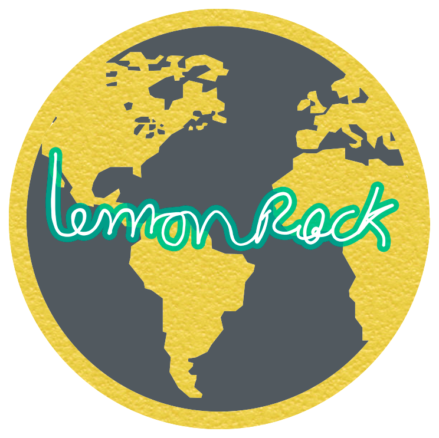
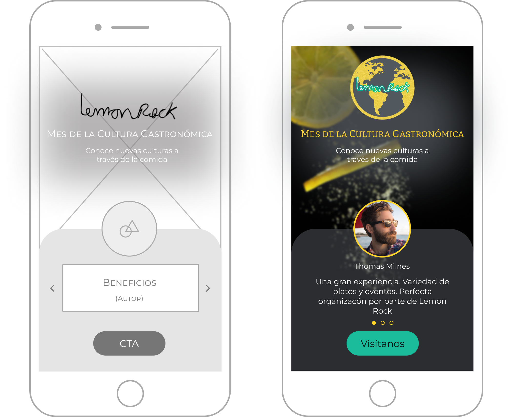
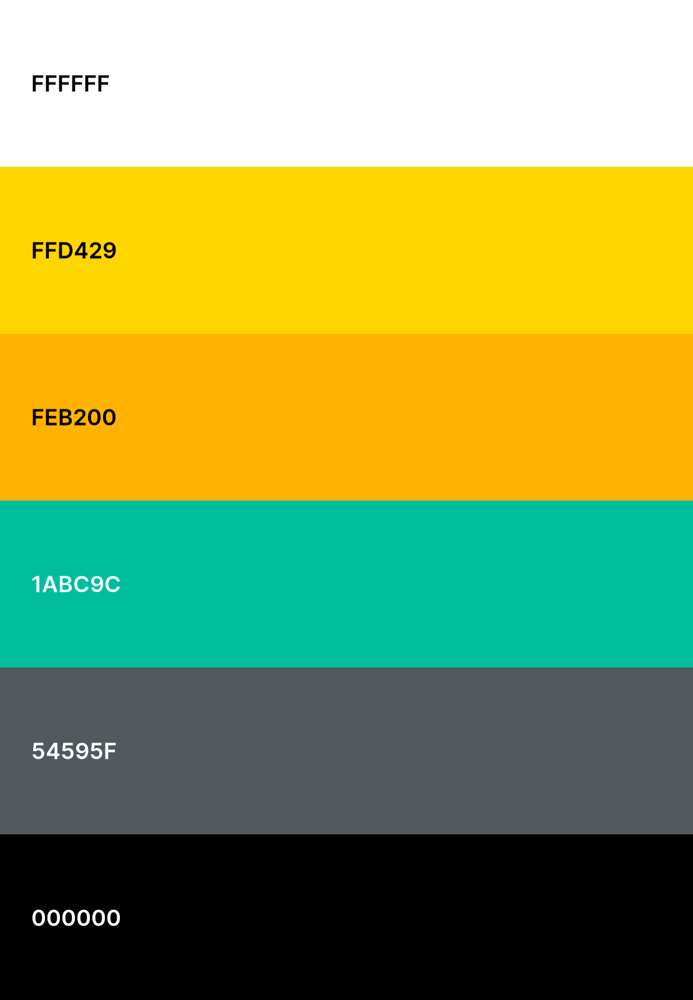
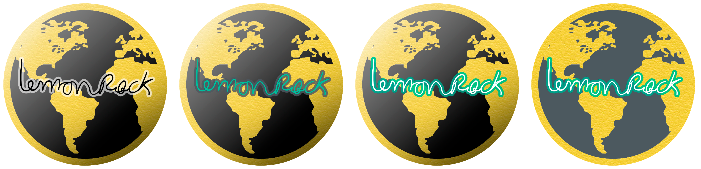

# DIU22
Prácticas Diseño Interfaces de Usuario 2021-22 (Tema: Hostels) 

Grupo: DIU1_MBM.  Curso: 2021/22 
Updated: 20/05/2022

Proyecto: 
>>> Mes de la Cultura Gastronómica en Lemon Rock

Descripción: 

>>> Proponemos durante Mayo una inmersión cultural a través de la comida y los eventos. Cada semana tendremos platos de distintos lugares del mundo acompañados de espectáculos relacionados con la temática de esa semana. Los sábados vendrá un reconocido chef especializado en la gastronomía de esa zona y mostrará la elaboración del menú estrella de esa semana. Ofreceremos un menú con distintos platos y sabores de los países pertenecientes a la cultura de esa semana. 

Logotipo: 
>>> 

Miembros
 * :bust_in_silhouette:  Raúl Durán Racero       
 * :bust_in_silhouette:  Mario López González     
 * :bust_in_silhouette:  Marina Muñoz Cano     

----- 

# Proceso de Diseño 

## Paso 1. UX Desk Research & Analisis 

 1.a Competitive Analysis
-----

A la hora de elegir competidores, hemos tenido en cuenta que el Lemon Rock
ya no es un Hostel, por lo que lo hemos comparado con un bar-cafetería con
música en directo y con 2 hostels.
En cuanto a los hostels, el Urban Jungle y el Cats Hostel ofrecen un servicio
similar al que ofrecía el Lemon Rock: un hostel de ambiente juvenil. El Urban
Jungle sería una opción más cercana al estar en Málaga, mientras que el Cats
Hostel ofrece un ambiente más fiestero. El bar-cafetería Bohemia Jazz es un
competidor actual del Lemon Rock al ofrecer un servicio similar: comer con
música en directo, aunque con diferentes estilos, y en el centro de Granada.

 1.b Persona
-----

Tom Milnes-García: Tom es un extranjero que visita España por sus raíces. Busca lugares donde alojarse, además de comer bien, acompañado de un buen ambiente y música.

Ainhoa Montagut Buigues: Ainhoa es una chica joven que estudia en Granada y quiere salir a cenar y tomar algo con sus amias por el centro de la ciudad.

 1.c User Journey Map

Al dejar de ser el Lemon Rock un hostel, lo hemos enfocado desde la parte de restaurante con eventos y música en directo.

Tom Milnes-García: Viaja a España con intención de alojarse en el Lemon Rock, pero al descubrir que ya no es un hostel decide alojarse cerca para poder ir a comer allí.

Ainhoa Montagut Buiges: Ainhoa quiere ir a cenar con sus amigas a un lugar nuevo. Navegando por Instagram ve en una historia un restaurante que le llama la atención y en el que nunca ha estado.

 1.d Usability Review
----

El documento de la Usability Review se encuentra en la siguiente [carpeta](https://github.com/MBM-devs/DIU/blob/master/P1/Usability%20Review/Usability-review.pdf).

Los principales problemas del sitio web residen en su funcionalidad y en parte al diseño, como puede ser el uso de texto de color negro sobre un fondo en el que hay varias imágenes que van cambiando, por lo que con algunas de ellas el texto no es legible. También ocurre que utilizan en otras secciones un color de letra amarillo sobre un fondo blanco, dificultando de nuevo la legibilidad del texto. 
En cuanto a la funcionalidad, utilizan una web de reserva externa al Lemon Rock, lo cual puede provocar ciertos problemas. 
No se proporciona ningún tipo de ayuda al usuario en cuanto a la web se refiere. 
Otro fallo importante está relacionado con la escasa retroalimentación de errores.
 
En resumen, opinamos que la página de Lemon Rock podría mejorar bastante con poco esfuerzo, mejorando un poco su diseño y funcionalidad.
Nuestra nota final ha sido un 64/100 (Moderate).

## Paso 2. UX Design  

 2.a Feedback Capture Grid 
----

A partir de las experiencias de los usuarios creados para la práctica 1 y las conclusiones sacadas, realizamos una malla receptora de información.  Elaboramos un cuadrante con cuatro apartados:

  ♡	Aspectos positivos que existen actualmente en la página web del Lemon Rock.

  ↑	Críticas constructivas a partir de la experiencia. 
 
  ?	Preguntas de los usuarios a partir de las personas creadas.
 
 💡	Nuevas ideas de mejora propuestas por los usuarios.

  
    

### PROPUESTA DE VALOR

Las conclusiones que sacamos en la práctica anterior gracias a las experiencias de las personas ficticias han hecho que nos sea fácil detectar los puntos fuertes y débiles de la web del Lemon Rock. A partir de las personas ficticias, hemos propuesto varias ideas posibles para el microsite.  

Finalmente optamos por un evento cultural que uniese los fuertes del Lemon rock: gastronomía y eventos. Nos inspiramos en que ofrecen eventos de intercambio de idiomas para proponer un evento cultural. 

Mes de la cultura gastronómica: Proponemos durante Mayo una inmersión cultural a través de la comida y los eventos. Cada semana tendremos platos de distintos lugares del mundo acompañados de espectáculos relacionados con la temática de esa semana. Los sábados vendrá un reconocido chef especializado en la gastronomía de esa zona y mostrará la elaboración del menú estrella de esa semana. Ofreceremos un menú con distintos platos y sabores de los países pertenecientes a la cultura de esa semana. 

 2.b ScopeCanvas
----
 

 2.b Tasks analysis 
-----

Vamos a identificar las tareas y su relevancia para los usuarios. Hemos elegido la Matriz de tareas/usuarios porque nos permite destacar aquellas tareas y grupos de usuarios más importantes para nuestro proyecto, para así tener claro cuales son los que hay que diseñar con un mayor detalle.

|                    User Tasks                   | User Group 1 - Clientes habituales | User Group 2 - Grupos de Amigos  | User Group 3 - Turistas | User Group 4 - Amantes de los eventos culturales |
|:-----------------------------------------------:|:----------------------------------:|:--------------------------------:|:-----------------------:|:------------------------------------------------:|
|                 Entrar en la web                |                 Low                |               High               |           Low           |                       High                       |
|                  Reservar mesa                  |                High                |               High               |           Low           |                       High                       |
|                Acudir sin reserva               |                 Low                |                Low               |           High          |                        Low                       |
|           Reservar entradas a eventos           |               Medium               |              Medium              |           Low           |                       High                       |
|               Consultar las RRSS                |                High                |               High               |           Low           |                      Medium                      |
|  Consultar el menú que se va a ofertar ese mes  |               Medium               |               High               |           High          |                        Low                       |
| Consultar los eventos según las salas del local |                 Low                |               High               |          Medium         |                       High                       |
| Ver los conciertos y actividades que se ofertan |                High                |              Medium              |          Medium         |                       High                       |
|      Consultar la  temática de cada semana      |               Medium               |               High               |           Low           |                      Medium                      |

Nuestros grupos de usuarios son los siguientes:
* Clientes habituales: Son clientes que visitan con frecuencia el establecimiento. Es uno de nuestros perfiles críticos. 
* Grupos de Amigos: Clientes que visitan el establecimiento como un grupo grande de personas. Se trata del segundo perfil crítico.
* Turistas: Clientes que no residen en Granada y buscan un sitio cerca de donde se encuentran para comer.
* Amantes de los eventos culturales: Se trata de todas aquellas personas que acuden al Lemon Rock movidas por los eventos que hay previstos y no le dan tanta importancia a la parte gastronómica.

 2.c IA: Sitemap + Labelling 
----

La organización lógica de navegación es la siguiente:

Desde todas las páginas de la app se podría acceder a las páginas de Reserva y la web oficial de Lemon Rock. En el sitemap no se muestran dichas navegaciones para simplificar el esquema.

|         Label        |                                                                                    Scope Note                                                                                    | User Group 2 - Grupos de Amigos  | User Group 3 - Turistas | User Group 4 - Amantes de los eventos culturales |
|:--------------------:|:--------------------------------------------------------------------------------------------------------------------------------------------------------------------------------:|:--------------------------------:|:-----------------------:|:------------------------------------------------:|
| HomePage             | Página principal de nuestro microsite que permite dirigirte a la información sobre el mes de la cultura gastronómica, reservar para éste evento o visitar la web del Lemon Rock. |               High               |           Low           |                       High                       |
| Saber más…           | Lleva a la página con toda la información del Mes de la cultura gastronómica. En ella se muestra la temática de cada semana con enlaces a los eventos de ésta.                   |               High               |           Low           |                       High                       |
| Reserva              | Dirige a la página de reserva para el Mes de la  Cultura Gastronómica.                                                                                                           |                Low               |           High          |                        Low                       |
| Menú                 | Accede a la carta de platos disponibles según la temática de la semana desde la que se accede durante el Mes de la Cultura Gastronómica.                                         |              Medium              |           Low           |                       High                       |
| Eventos              | Consulta los eventos que se celebran la semana desde la que se accede durante el Mes de la Cultura Gastronómica.                                                                 |               High               |           Low           |                      Medium                      |
| Visita nuestra web…  | Lleva a la página principal de la web del Lemon Rock.                                                                                                                            |               High               |           High          |                        Low                       |

 2.d Wireframes
-----
En nuestro prototipo indicamos mediantes flechas a qué pantalla lleva cada botón.

Hemos optado por un diseño simple y minimalista en el que en todo momento destaca la acción principal: Reservar. Intentamos que en todas las páginas se muestre la información de forma concisa y visual, sin excesivos textos, tratando de mejorar los puntos débiles encontrados durante el análisis.

## Paso 3. Mi UX-Case Study (diseño)

 3.a Moodboard
-----

Hemos creado nuestro mood board en Milanote, se puede consultar en el siguiente [enlace](https://app.milanote.com/1NKr8q16lfUh4j?p=DNUS5Zm87SG). 

En el apartado de [Guidelines](#método-uximgguidelinespng-3c-guidelines) explicamos un poco mejor cada elemento.

Para hacer el logotipo hemos hecho utilizando Photoshop con resolución 744 x 744 pixeles, por lo que no se podria usar como cabecera de Twitter, habría que adaptarlo o utilizar el logo como foto de perfil y en el encabezado poner una imagen del restaurante por ejemplo. Además hemos usado Procreate, una app de iPad para conseguir el logo oficial con mayor calidad, retintándolo sobre la foto original.

  3.b Landing Page
----

Nuestra propuesta es una página sencilla con el título del evento sobre una imagen de algún plato que inspire al usuario a entrar en la página. El texto tendrá un fondo borroso para que se pueda visualizar correctamente sobre la imagen.
Debajo de la imagen se muestra un carrusel de tarjetas con los beneficios de la propuesta que pueden ser: frases con slogans e imágenes inspiradoras, testimonios de usuarios con una foto de éstos, etc. 
Por último, un botón con la acción principal que queremos destacar: ir a la página del evento.

 3.c Guidelines
----

**Patrones IU**

Hemos obtenido los patrones de la página web de [UI Patterns](https://ui-patterns.com/). 
* **Calendar picker**: Permite al usuario escoger una fecha del calendario. Este patrón nos será útil para que el usuario pueda reservar mesa en la fecha deseada. 
* **Event calendar**: Permite al usuario localizar fácilmente los eventos que ocurren en la fecha deseada. Los eventos se muestran de manera clara y concisa. 
* **Carrusel**: Como en una app móvil no disponemos de tanto espacio en la pantalla, los eventos se mostrarán de forma más visual con este patrón, mostrando la información clave de éstos: imagen, nombre, fecha, sala, etc.
* **Module Tabs**: Usaremos este patrón para navegar rápidamente por la información de una semana concreta: los eventos y la carta con el menú de la misma. De esta forma podemos mostrar en un mismo contenedor la información completa de la semana y se puede navegar cómodamente entre las dos secciones. 

**Guidelines**

* **Paleta de colores**: Tomamos como base la paleta del sitio oficial de Lemon Rock que extrajimos mediante la herramienta [Stylify Me](http://stylifyme.com/). Consideramos que esta paleta es una parte característica de su identidad, y que le hace destacar del resto. A ésta paleta le añadimos un azul verdoso como complementario para los elementos que queramos destacar y le añadimos también un gris azulado y un amarillo más oscuro por si eran necesarios para que algun texto se viese mejor.

* **Logotipo (Imagotipo)**: Hemos adaptado el logotipo del Lemon Rock, que era el propio nombre del restaurante escrito a mano para que represente mejor el ambiente multicultural que proponemos. Hemos creado un globo terráqueo donde los continentes son sustituidos por una textura de limón. Además superponemos el logo original del Lemon Rock en blanco y con un borde del color complementario que habíamos elegido, para que de la impresión de que las letras son luces de neón.
Durante su desarrollo planteamos diferentes estilos para el logo, hasta que finalmente nos decidimos por uno en concreto. A continuación mostramos la evolución del logo, la ultima imagen es por la que nos decantamos finalmente:

* **Tipografía:** La tipografía para el texto de la página que usaremos será Montserrat, ya que es la que utiliza el Lemon Rock y nos parece adecuada por su legibilidad y diseño. 
Para los títulos en un principio buscamos una tipografía Serif que contrastase con la elegida para el texto, por lo que elegimos Soria al hacer el moodboard, pero al comenzar con el prototipo, esta fuente no estaba disponible en Figma por lo que la cambiamos a Bitter que nos gustó mas y tiene un estilo parceido. Para elegir la tipografía utilizamos [Font Pair](https://www.fontpair.co).

* **Iconografía**
Los iconos los hemos obtenido de [Font Awesome Icons](https://fontawesome.com/icons), que nos ofrece una gran variedad de iconos con un diseño que se adapta muy bien a nuestra aplicación. Los iconos escogidos son muy representativos, para no dejar duda de su función. Un ejemplo es el icono del calendario, que utlizamos para que el usuario pueda elegir cómodamente una fecha.

* **Estilo de lenguaje**
El estilo de lenguaje usado en toda la aplicación es simple, para que todo usuario pueda entender lo que ofrecemos fácilmente, ya que nuestro objetivo es tener el mayor número de usuarios posible.

  3.d Layout
----

Hemos diseñado varias de las pantallas de nuestra aplicación. Para ello, hemos utilizado Figma, usando todos los patrones y guidelines que hemos definido anteriormente. 
Hemos optado por un diseño en modo oscuro ya que combinaba mejor con mejor la paleta elegida, como el color principal es el amarillo pensamos que sobre un fondo blanco no destacaría lo suficiente. Además queríamos mejorar algunos fallos que encontramos en la web del Lemon Rock en la practica 1, ya que en varias ocasiones observamos que el texto no era legible por los colores utilizados. 
Para poder verlo en tiempo real, se puede acceder a Figma mediante el siguiente [enlace](https://www.figma.com/proto/ivoOYcn7CJ1tNShGUV6nie/Layout?node-id=4%3A127&scaling=min-zoom&page-id=0%3A1&starting-point-node-id=4%3A127).

De izquierda a derecha, tenemos ordenadas nuestras páginas:

* En primer lugar nos encontramos la página principal, donde vemos una breve explicación del evento del Mes de la Cultura Gastronómica, y un carrusel de imágenes de varios platos de distintas culturas. 
* El enlace **Saber más...** nos lleva a la distribución del mes, es decir, una paǵina con las 4 semanas del evento. 
* Al hacer click en cualquier semana, nos lleva a la página de esa semana donde tenemos un carrusel de los eventos, con una descripción e imagen de cada uno, y la carta general de la semana, con los platos más destacados.
* Si en algún momento queremos retroceder a la página anterior, tenemos un botón de una flecha en la parte superior izquierda de la pantalla.
* Además, desde cualquier página de la aplicación tendremos disponibles las opciones tanto de visitar la página web oficial del Lemon Rock, como de entrar en la página de Reserva, donde podremos introducir nuestros datos y escoger la fecha y sala a la que se desea asistir.

 3.e ¿My UX-Case Study?
-----

Para mostrar el funcionamiento de nuestra aplicación grabamos un video del prototipo para mostrar los enlaces e interacciones para después convertirlo a gif.

## Paso 4. Evaluación 

 4.a Caso asignado
----

>>> Breve descripción del caso asignado con enlace a  su repositorio Github

 4.b User Testing
----

>>> Seleccione 4 personas ficticias. Exprese las ideas de posibles situaciones conflictivas de esa persona en las propuestas evaluadas. Asigne dos a Caso A y 2 al caso B
 

| Usuarios | Sexo/Edad     | Ocupación   |  Exp.TIC    | Personalidad | Plataforma | TestA/B
| ------------- | -------- | ----------- | ----------- | -----------  | ---------- | ----
| User1's name  | H / 18   | Estudiante  | Media       | Introvertido | Web.       | A 
| User2's name  | H / 18   | Estudiante  | Media       | Timido       | Web        | A 
| User3's name  | M / 35   | Abogado     | Baja        | Emocional    | móvil      | B 
| User4's name  | H / 18   | Estudiante  | Media       | Racional     | Web        | B 

. 4.c Cuestionario SUS
----

>>> Usaremos el **Cuestionario SUS** para valorar la satisfacción de cada usuario con el diseño (A/B) realizado. Para ello usamos la [hoja de cálculo](https://github.com/mgea/DIU19/blob/master/Cuestionario%20SUS%20DIU.xlsx) para calcular resultados sigiendo las pautas para usar la escala SUS e interpretar los resultados
http://usabilitygeek.com/how-to-use-the-system-usability-scale-sus-to-evaluate-the-usability-of-your-website/)
Para más información, consultar aquí sobre la [metodología SUS](https://cui.unige.ch/isi/icle-wiki/_media/ipm:test-suschapt.pdf)

>>> Adjuntar captura de imagen con los resultados + Valoración personal 

 4.d Usability Report
----

>> Añadir report de usabilidad para práctica B (la de los compañeros)

>>> Valoración personal 

>>> ## Paso 5. Evaluación de Accesibilidad  (no necesaria)

>>>   5.a Accesibility evaluation Report 
>>>> ----

>>> Indica qué pretendes evaluar (de accesibilidad) sobre qué APP y qué resultados has obtenido 

>>> 5.a) Evaluación de la Accesibilidad (con simuladores o verificación de WACG) 
>>> 5.b) Uso de simuladores de accesibilidad 

>>> (uso de tabla de datos, indicar herramientas usadas) 

>>> 5.c Breve resumen del estudio de accesibilidad (de práctica 1) y puntos fuertes y de mejora de los criterios de accesibilidad de tu diseño propuesto en Práctica 4.

## Conclusión final / Valoración de las prácticas

>>> (90-150 palabras) Opinión del proceso de desarrollo de diseño siguiendo metodología UX y valoración (positiva /negativa) de los resultados obtenidos  

